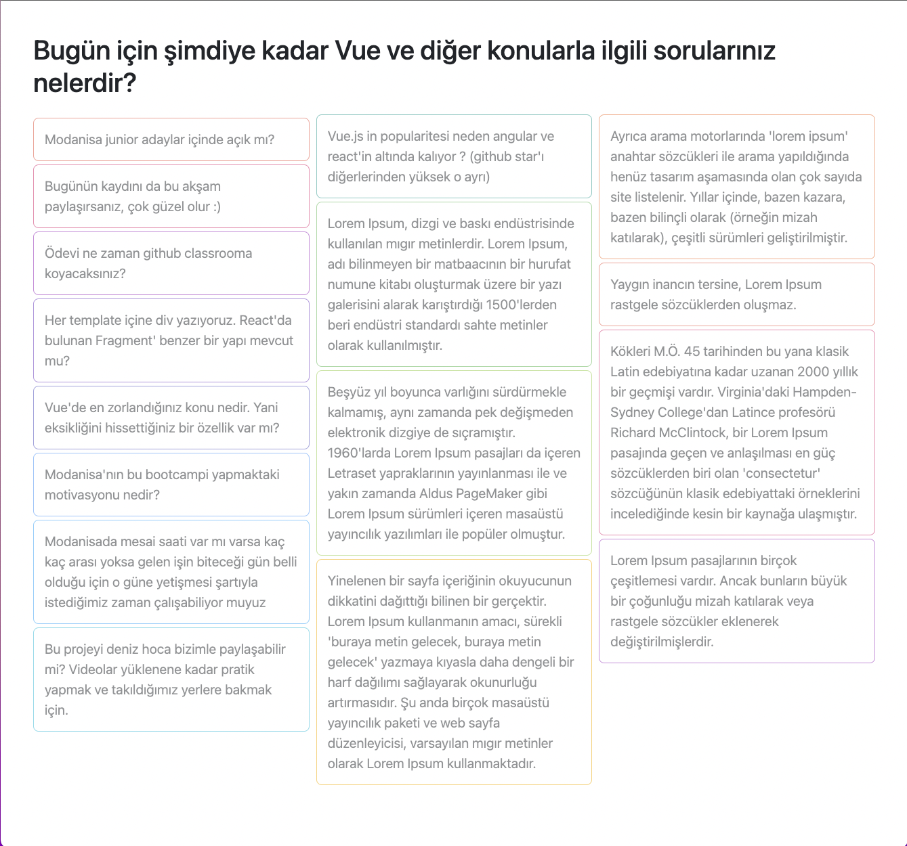
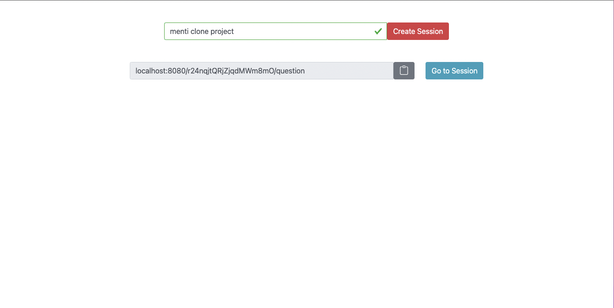
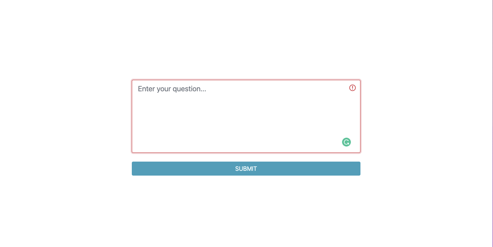

# menti-clone

**This project is menti clone that is developed using vue.js and vuefire.**


```bash
git clone https://github.com/fnkaya/vue-menti-clone.git
```


```bash
cd vue-menti-clone
```


```bash
yarn install
```


You need to firebase account to run this application. You should create firebase app and firestore database. After completing those steps you should take firebase app credentials in project settings and put them into .env file or directly into ***"src/firebase/index.js"***.


```javascript
const firebaseApp = firebase.initializeApp({
    apiKey: "your-api-key",
    authDomain: "your-api-domain",
    projectId: "your-project-id",
    storageBucket: "your-storage-bucket",
    messagingSenderId: "your-messaging-sender-id",
    appId: "your-app-id",
});
```


Also, you can follow these instructions [Create a Cloud Firestore project.](https://firebase.google.com/docs/firestore/quickstart)


```bash
yarn serve
```







